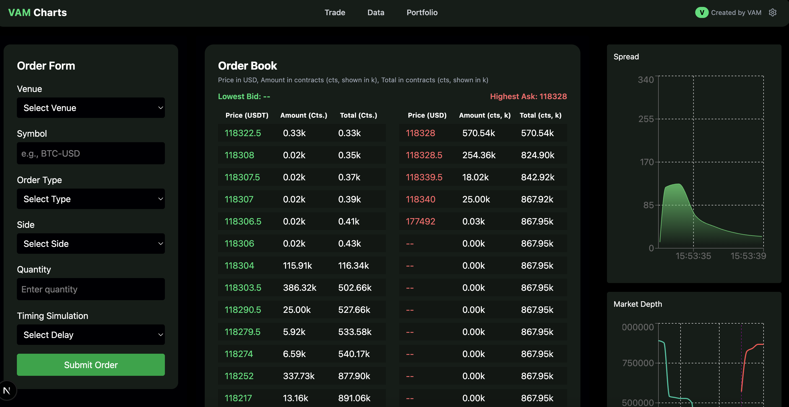

# Order Book Visualizer 💹

A lightweight, performant Next Js React app that simulates an **Order Book UI** using live websocket data. It features a spread chart, depth visualization, and live order matching — inspired by real trading interfaces such as Go Quant.

---

## 🖼️ Preview

<!-- Replace `./screenshots/ui.png` with your actual screenshot path -->



---

## 🚀 Features

- 📡 **Real-time Order Book** using WebSocket data
- 📊 **Spread Chart** to visualize bid-ask spread dynamically
- 🧮 **Aggregated Depth Chart** to simulate order matching depth
- ♻️ Modular custom hooks: `useOrderBook`, `useSpreadData`, and `useProcessData`
- ⚛️ Built with React + ContextAPI (lightweight state management)
- 📁 Clean component structure and well-documented code

---

## 🔧 Tech Stack

- **Frontend**: Next JS
- **State Management**: ContextAPI
- **Charting**: Recharts
- **WebSocket Handling**: Native JS + custom hooks

---

## 🧠 Architecture

The app uses a **custom hook-driven** architecture to ensure separation of concerns and maintainability.

```plaintext
useOrderBook → Fetches + maintains live bids & asks
   |
   ├── useSpreadData → Derives spread metrics from order book
   └── useProcessData → Aggregates depth info for visualization
